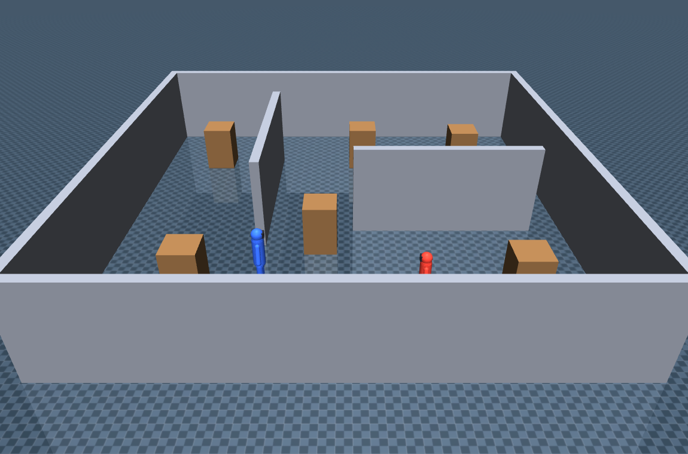
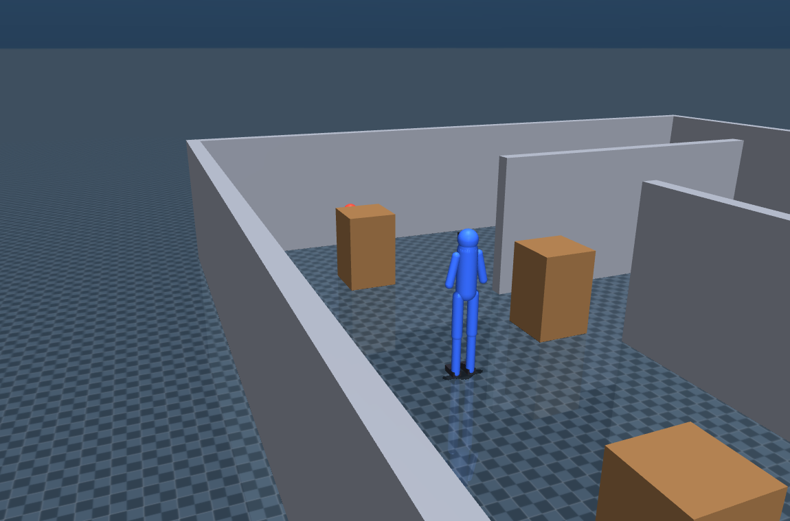
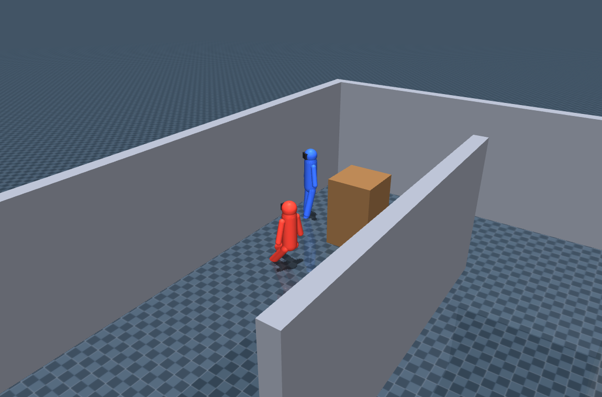
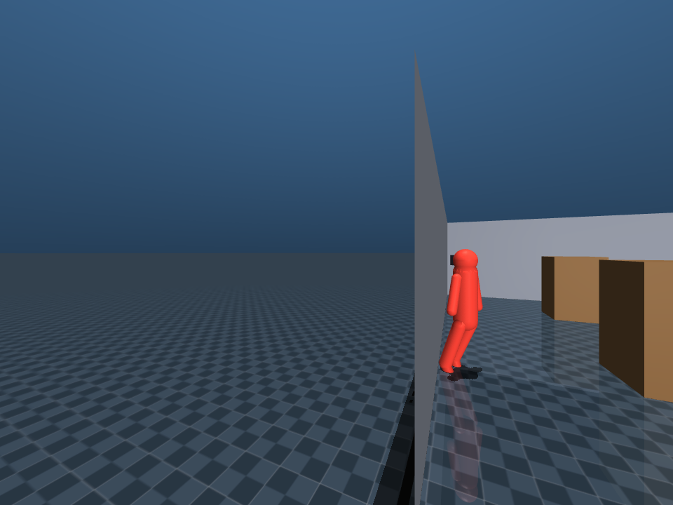

# Teaching two humanoids to play hide-and-seek

*A from-scratch multi-agent reinforcement-learning project: a blue seeker and a
red hider learn to chase and evade each other, by self-play, in a walled arena —
built on MuJoCo + Stable-Baselines3.*



Two little humanoids. One always seeks, one always hides. They start knowing
nothing and, by repeatedly playing *each other*, the seeker learns to hunt and
the hider learns to duck behind cover and break line of sight. This post walks
through how the whole thing works — the world, the agents, the perception, the
learning — what's in the repo, the exact training values, and the honest results
(including the bug that made it *look* impossible at first).

---

## The idea in one picture

- **Blue seeks, red hides.** Blue wins by getting close enough to red *with a
  clear line of sight*; red wins by surviving until the clock runs out.
- **Hiding is real.** Vision is ray-cast line-of-sight: walls and boxes block the
  view. Red can even **crouch** to drop its head below low cover.
- **Nobody is scripted.** Both policies are trained by **self-play** — each round
  the seeker practices against the current hider, and vice versa.

The interesting problem here is *strategy* (searching, cornering, hiding,
peeking) — not learning to physically walk. So the humanoids use **simplified,
kinematic locomotion**: they glide and turn and crouch, and can't fall over. RL
gets to focus entirely on the game.

---

## How it works

### 1. The world — a procedural arena

The scene is generated in code (`hideseek/arena_builder.py`) with two presets,
`room` and `maze`. Every arena has:

- **Perimeter walls** that bound the play area,
- **Tall dividers** (2.0 m) that block *everyone's* line of sight,
- **Low cover boxes** (1.1 m) — tall enough to hide a *crouched* agent, short
  enough that a *standing* agent sees right over them.

That height difference is the whole crouch mechanic in one number.

### 2. The agents — articulated but kinematic

Each humanoid (`hideseek/humanoid.py`) is a real articulated body — torso, head,
arms, hip/knee-jointed legs — but it's driven on a **planar root** (slide-x,
slide-y, yaw) by velocity, plus a **crouch** degree of freedom. The action is
just three numbers:

```
action = [ forward, turn, crouch ]
```

Because there's no roll/pitch, an agent can't fall over — locomotion is a solved
problem and the policy spends its capacity on *where to go and when to duck*.
Crouching flexes the legs and drops the eye from **1.57 m → 0.94 m**, below the
1.1 m box tops.

### 3. Perception — ray-cast line of sight

Vision (`hideseek/vision.py`) is built on MuJoCo's `mj_ray`:

- a **16-ray lidar** ring at a low height (senses both walls and low boxes) for
  navigation, and
- a **line-of-sight** check to the opponent: it must be inside a view cone,
  within range, and **not occluded** by a wall or box.

This is what makes hiding meaningful. A standing seeker looks *over* a low box
and sees a standing hider — but a hider crouched right behind that box drops
below the seeker's sightline and vanishes:



### 4. The match — prep, seek, catch

A match has two phases: a short **prep phase** (the seeker is frozen and blind
while the hider scrambles to cover), then the **seek phase**. The seeker wins by
**tagging** the hider — getting within `catch_radius` with no *tall wall* between
them (low cover doesn't save you, so ducking at the last instant no longer dodges
the tag). The hider wins by surviving to `match_time`. Every knob — durations,
speeds, vision, rewards, and even whether a tag needs line of sight
(`catch_needs_line_of_sight`) — is in a config file.

### 5. The observation and reward

Each agent sees a **32-number observation**: its own pose and velocity, the lidar
ring, the opponent's relative position *when visible* (plus a short memory of
where it was last seen), and the match clock. The reward is roughly zero-sum:

- **Seeker:** rewarded for seeing the hider, for *closing distance* (a dense term
  that gives a gradient even when the hider is out of view), and a big bonus for
  the catch.
- **Hider:** rewarded for staying unseen and for opening distance, penalized when
  seen or caught.

---

## The learning — self-play that doesn't cycle

Training (`hideseek/train.py`) runs **two PPO policies** in alternating rounds.
The naive version — always train against the *latest* opponent — makes the two
agents chase each other in circles and forget old skills. So instead:

- **Opponent pool (league-lite).** Every round both policies are snapshotted into
  a pool, and during a training phase each parallel environment faces a
  *different* sampled past opponent. The seeker has to beat a *variety* of
  hiders, not overfit one.
- **Dense distance shaping** gives the seeker a gradient even when it can't see
  the hider, so it learns to *search* instead of freezing.
- **Per-round win-rate evaluation** — after every round the two current policies
  play a batch of matches and the seeker win-rate is logged. That number, not a
  single match, is how you judge whether self-play is healthy (it should stay
  *balanced*, not run away to 0% or 100%).

---

## What's in the repo

```
hide-and-seek/
├── hideseek/
│   ├── config.py          # one dataclass config: arena / agent / vision / match / train
│   ├── humanoid.py        # procedural articulated humanoid (MJCF fragments)
│   ├── arena_builder.py    # procedural scene: walls + cover + 2 agents (room / maze)
│   ├── vision.py           # ray-cast lidar + line-of-sight occlusion
│   ├── env.py              # HideAndSeekEnv: 2 agents, prep/seek phases, rewards
│   ├── train.py            # self-play PPO with opponent pool + win-rate eval
│   ├── match.py            # run matches, report blue/red win-rates, record video
│   └── visualize.py        # interactive match viewer
├── configs/                # default.yaml (room), maze.yaml, quick.yaml
├── tests/                  # fast CPU tests (env, presets, crouch-occlusion mechanic)
└── Makefile
```

The env is single-agent from the trainer's point of view — it controls one role
and the opponent is an injected frozen policy — which is exactly what lets us
train with plain PPO and run self-play by swapping opponents. A "match" is just
the seeker's env with a trained hider plugged in as the opponent.

Full details are in the [README](../README.md); the design decisions and every
gotcha are in the [operating manual](../CLAUDE.md).

---

## The training values

Everything below lives in [`configs/default.yaml`](../configs/default.yaml) and
is reproducible from there.

| Group | Setting | Value |
|---|---|---|
| **Arena** | preset / size | `room` / 10 m |
| **Agent** | seeker top speed | 3.0 m/s |
| | hider speed fraction | **0.65** (hider is slower, so the seeker can close) |
| | max turn rate | 1.5 rad/s |
| | reverse allowed | no (must face where it moves) |
| **Vision** | lidar rays / range | 16 / 8 m |
| | view cone (half-angle) / range | 1.9 rad / 12 m |
| | catch radius | 1.6 m |
| **Match** | match time / prep time | 20 s / 1 s |
| | catch bonus / caught penalty | +50 / −50 |
| | hider hidden-reward | 0.6 per step |
| **Train** | algorithm | PPO (MLP, CPU) |
| | rounds × steps/phase | 12 × 150 000 |
| | opponent pool size | 5 |
| | eval matches / round | 12 |
| | parallel envs | 8 |
| | learning rate / γ | 3e-4 / 0.99 |
| | n_steps / batch | 512 / 2048 |

---

## Results — and one more fix

Our first honest result came under a **strict catch rule**: the seeker had to
*see* the hider at the moment of the tag. After tuning speeds and timers, a
20-match head-to-head of the trained policies landed at:

> Strict rule: **blue 20% · red 80% · avg time-to-catch 12.2 s** — hiding dominated.

Blue genuinely learns to hunt (here it is closing in on red by a cover box):



But watching in the seeker's POV showed *why* it kept losing: blue would corner
red, red would duck behind a box at the last instant, `seeker_sees` flipped to
false, and **no tag registered** — the hider phased out of the catch. The
seeker's real problem was never speed; it was losing contact at the buzzer.

So we added **tag by proximity** (`catch_needs_line_of_sight: false`, now the
default): you tag anyone you get close enough to, as long as no *tall wall* is
between you — low cover no longer saves a hider you've already cornered.

> **Option A (tag by proximity): blue 35% · red 65% · avg time-to-catch 12.8 s**

That's up from 20% under the strict rule, with training rounds repeatedly
touching 50% — blue is now genuinely competitive and the matches are close.
Removing the "hider phases out at the last second" failure mode did more than any
amount of speed/timer tuning.

The broader lesson: the balance is a set of **dials**, not a fixed outcome. The
speed edge (`hider_speed_frac`), `match_time`, `prep_time`, the hider's
`hidden_reward`, and the catch rule itself all move it — the shipped config is
one operating point that keeps both sides in the game.

---

## Two bugs worth remembering

Getting here took two instructive failures:

1. **The agents were invisibly *stuck*.** The first trained runs sat at 0%
   seeker win-rate. The cause wasn't the RL at all — the humanoids' *visual*
   geoms had defaulted to colliding, so the feet dragged on the floor and the
   legs self-collided, pinning the 76 kg bodies in place (top speed ~0.01 m/s).
   The fix was one line: make visual geoms non-colliding so only an invisible
   capsule collides. Movement restored; catches started happening.
2. **Equal speed is uncatchable.** Even once they moved, an equal-speed seeker
   could *see* the hider 83% of the time but never close the gap — a pursuer at
   the evader's speed literally cannot catch it. Giving the seeker a speed edge
   fixed it (verified: ideal pursuit went from 0/6 to 6/6 catches).

There was also a fun one: agents that appeared to "walk backwards" because the
world-velocity was computed once per control step from the *old* heading — fixed
by recomputing it from the *current* heading every sim substep, so an agent
always moves where it's facing (and its view cone leads the way).

---

## Run it yourself

```bash
git clone <your-repo-url> hide-and-seek
cd hide-and-seek
python -m venv .venv && source .venv/bin/activate
pip install -e .

make smoke                               # ~1 min pipeline check
make train CONFIG=configs/default.yaml   # full self-play
make tb                                   # watch eval/seeker_winrate climb

python -m hideseek.match --run outputs/<run> --matches 20   # who wins?
make watch RUN=outputs/<run>                                # watch it live
```

No GPU required — the policies are small MLPs that train on CPU.

### See through their eyes

In the viewer, press **V** to toggle the camera: **overhead → seeker first-person
POV → hider POV** (or start on one with `--view seeker|hider`). Watching a chase
from the seeker's eyes is the clearest way to *feel* the line-of-sight mechanic —
you see exactly when the hider slips out of the view cone or ducks behind cover.
Here's a real frame from blue's POV as it closes on red:



---

## Where it goes next

- Randomized wall layouts per episode (curriculum, better generalization)
- Team play — multiple seekers and hiders
- A pretrained walking controller under the strategy policy, for physics-based
  gait instead of kinematic gliding
- Pixel observations instead of ray-casts

**Links:** [README](../README.md) · [operating manual / design notes](../CLAUDE.md)
· [default config](../configs/default.yaml)
